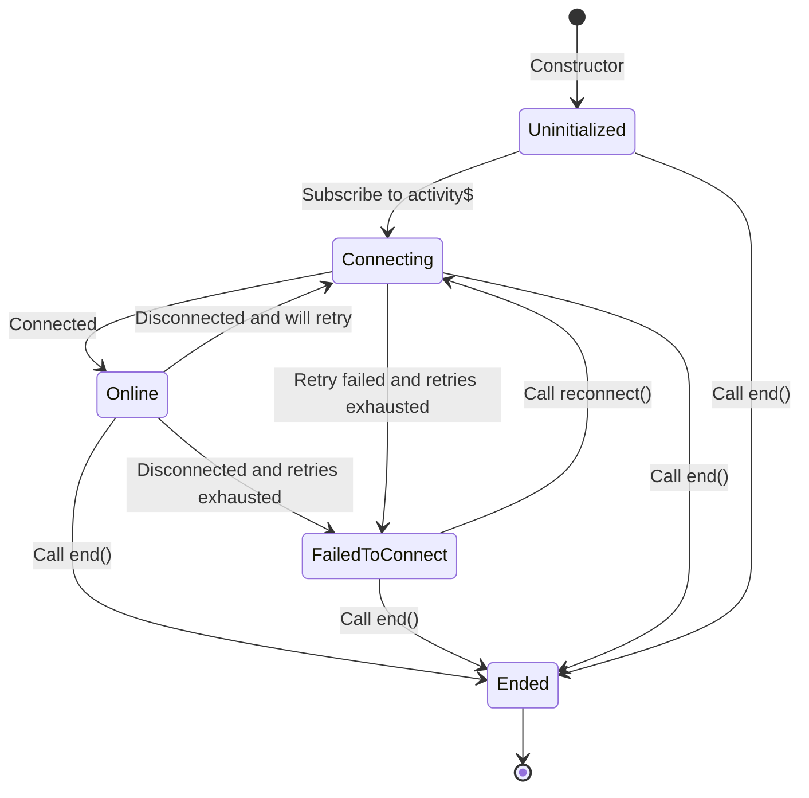

# API

DirectLineJS is a chat adapter. It is designed as a state machine with specific behaviors.

# State machine

The state is defined by the connection status observable (a.k.a. `connectionStatus$`).

## Uninitialized

This is the initial state of the chat adapter.

From:

- Start: when the chat adapter object is created
   - Call to `new DirectLine()`

## Connecting

When the chat adapter is establishing a connection to the bot.

To prevent service overloading, a backoff must be introduced for retries.

When retrying to connect, it should first transit to this state, before performing the backoff (a.k.a. sleep).

The chat adapter will not transit from `Connecting` to `Connecting` when retrying multiple times. It is done transparently and cannot be observed.

From:

- `Uninitialized`: when subscribing to `activity$`
   - Call to `directLine.activity$.subscribe()`
- `Online`: when disconnected while retry is possible
- `FailedToConnect`: when explicitly reconnect
   - Call to `directLine.reconnect()`

## Online

When the chat adapter is connected to the bot.

A connection will be marked as "stable" after it has been in this state for more than 1 minute. A stable connection has these benefits:

- No backoff at `Connecting` state at the first attempt
- Retry counter is reset

From:

- `Connecting`: when connection established

## FailedToConnect

When all retry attempts are exhausted.

From:

- `Connecting`: retrying connection and failed to connect after all retry attempts are exhuasted
- `Online`: when disconnected and all retry attempts are exhausted

## Ended

When `end()` is called.

The activity observable (a.k.a. `activity$`) will be completed.

The connection status observable (a.k.a. `connectionStatus$`) will be completed after transitioned into `Ended`.

After transitioned to this state, all resources should be released.

From:

- `Uninitialized`: call `end()` before subscribing to `activity$`
- `Connecting`: call `end()` while it is attempting to connect
- `Online`: call `end()` while it is connected
- `FailedToConnect`: call `end()` after all retry attempts are exhausted

# Sending an activity

To send an activity to the bot, call `postActivity()`. This would put the activity on the bot queue and returns an observable.

There will be two acknowledgements for the activity:

- Acknowledgement when the activity is on the bot queue
- Acknowledgement when the bot finished processing the activity (a.k.a. read receipt)

Due to distributed nature of the system, these acknowledgements may come in random order.

## The activity is on the bot queue

The observable returned by the `postActivity()` call will tell if the activity is successfully queued or not.

- When the queue operation completed successfully:
   - The activity ID generated by the bot or service will be observed
   - Then, the observable is completed
- When the queue operation failed:
   - The observable will be errored out

## The bot finished processing the activity

The activity will be echoed back via the activity observable (a.k.a. `activity$`). It may come with more details about the activity, such as activity ID, channel ID, conversation ID, timestamp, etc.

Before the bot finished processing of the activity, it may send responses. In other words, bot response could arrive sooner than the read receipt. The `replyToId` in the activity should be used to determine which activity the bot is responding to.

# Retrying connections

Connection should be automatically retried. A backoff should be applied if the network environment is unstable.

If the connection is stable, it should reset retry counter.

Depends on the service, a stable connection could means:

- a minute has been passed;
- a certain number of activities are exchanged;
- a certain size of packets are exchanged.

## Optional: improve retry experience

If the connection was stable and is disconnected, it should retry the connection without backoff in its first attempt. This can be done through retry counter or exponential backoff.

# Reconnecting

When all retry attempts are exhausted, the chat adapter will "hibernate". Calling `reconnect()` will wake up and revive the chat adapter and reset the retry counter.

`reconnect()` can be called multiple times, as long as the chat adapter is not ended.

Calling `reconnect()` while the chat adapter is active, should do nothing.

Thus, if the chat adapter is not ended, `reconnect()` is safe to call immediately after app switching or visibility change, regardless of the connection status.

# Ending the chat adapter

When `end()` is called, all resources held by the chat adapter must be released. Further `postActivity()` or `reconnect()` should fail.
